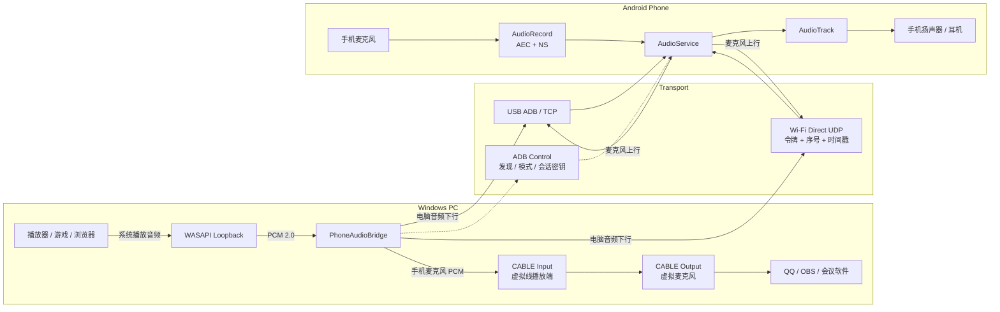

# PhoneAudioBridge

[中文](#中文) | [English](#english)

## 实现架构 / Architecture



```text
下行：Windows 音频 -> WASAPI -> USB/Wi-Fi -> Android AudioTrack -> 手机扬声器
上行：手机麦克风 -> AudioRecord/AEC -> USB/Wi-Fi -> VB-CABLE -> Windows 软件
```

## 中文

PhoneAudioBridge 是 Windows 电脑没有音响、耳机或可用外放设备时的应急音频方案。
只要手边有一台 Android 手机，就可以把它临时作为电脑扬声器，并可将手机麦克风回传给 Windows。

> 当前仅支持 Windows → Android，暂不支持 iPhone / iOS。

通过 USB 数据线或局域网 Wi-Fi 将 Android 手机作为电脑的音频终端：

- 电脑系统播放音频送到手机扬声器或手机连接的耳机。
- 手机麦克风回传电脑，经虚拟音频线提供给 QQ、会议、录音或直播软件。
- USB 模式音频走 ADB 数据线；Wi-Fi 模式音频使用局域网直连 UDP，ADB 只负责发现和交换一次性令牌，无云端中转。

这是普通 Android 应用的 ADB 音频桥方案，不会把手机注册成系统级 USB 声卡，
也不自带 Windows 虚拟麦克风驱动。电脑软件使用手机麦克风需要安装虚拟音频线。

## 快速开始

### 安装手机端

手机开启开发者选项和 USB 调试，连接电脑并确认授权：

```powershell
.\build-android.ps1 -Install
```

手机打开 `Phone Audio Bridge`，允许麦克风权限，点击“启动音频”。
APK 路径为 `android/app/build/outputs/apk/debug/app-debug.apk`。
构建需要 JDK 17、Gradle 8.9、Android SDK 35 和 Build Tools 34.0.0。
SDK 默认路径为 `D:/Android/Sdk`，可通过 `-Sdk` 指定；Gradle 可通过 `-Gradle` 指定。

### 启动电脑端

```powershell
.\start-pc.ps1
```

脚本创建或修复 `.venv`，校验依赖并打开图形窗口。使用 Python 3.11；
SoundCard 0.4.5 配合 NumPy 1.26 系列，避免 NumPy 2.x 接口不兼容。
启动前会实际检查 NumPy PCM 操作、CFFI 和 SoundCard API；检查失败时完整重装音频依赖。
修复环境前关闭旧电脑端窗口，避免运行中的音频模块锁住安装文件。

在窗口中选择：

- **手机设备**：选择 USB 或 Wi-Fi 手机。自动模式优先选择唯一 USB 手机，否则选择唯一在线无线手机。
- **电脑音频来源**：选择电脑软件实际播放声音的设备，通常为默认扬声器或耳机。
- **手机麦克风接收设备**：仅传送电脑声音时选“关闭麦克风回传”；需要手机麦克风时选虚拟音频线播放端，例如 `CABLE Input`。
- **音频品质**：标准为 48 kHz/16-bit，中品质为 96 kHz/24-bit，无损品质为 192 kHz/24-bit。

点击“检测声道”可读取当前所选 Windows WASAPI 端点以及 Android 当前输出设备，显示当前声道、
设备声明最大声道、两端共同能力和协议实际传输声道。能力检测不会启动 PCM 音频流。

点击“连接”。手机应显示“电脑音频 已连接”；启用回传后还会显示“手机麦克风 已连接”。
切换设备或传输方式前先点击“停止”。

## Wi-Fi ADB

手机与电脑连接同一局域网。首次使用时以 USB 连接手机并确认调试授权，然后在电脑端点击
“USB 转无线”。程序会自动读取手机 WLAN IPv4、执行 `adb tcpip 5555`、连接无线 ADB并刷新设备列表，
不需要手动填写 IP。

等价命令为：

```powershell
adb -s USB_SERIAL tcpip 5555
adb connect PHONE_IP:5555
```

转换完成后可以拔掉 USB 数据线。网络切换、手机重启或关闭开发者调试后可能需要重新通过 USB 转换。
手机音频服务仍需在手机端启动。
USB/Wi-Fi 共用同一个 Android APK。

```powershell
.\.venv\Scripts\python.exe pc\bridge.py --transport wifi --serial PHONE_IP:5555
```

## 手机麦克风与 QQ

普通扬声器只会播放手机麦克风的声音，不会成为 Windows 的麦克风输入。
安装 VB-CABLE 或同类虚拟音频设备，才能把回传声音提供给电脑软件：

```text
手机麦克风 -> 本工具 -> CABLE Input（播放端）
                            |
                            v
                       CABLE Output（录制端） -> QQ / 会议软件
```

VB-CABLE 官网：<https://vb-audio.com/Cable/>。
下载 Windows 驱动 ZIP 并解压，64 位 Windows 以管理员身份运行 `VBCABLE_Setup_x64.exe`，
点击 `Install Driver`，完成后重启电脑。

本工具刷新设备后选 `CABLE Input`。QQ 若跟随系统默认麦克风：

1. 按 `Win + R`，输入 `mmsys.cpl`，打开“录制”。
2. 将 `CABLE Output` 设为默认设备和默认通信设备。
3. 完全退出 QQ，包括托盘图标，再重新打开通话。

对着手机说话，检查 `CABLE Output` 录制端的音量条是否跳动。
电脑正常声音输出仍选原来的扬声器或耳机，不要也选 `CABLE Input`，以免系统音频混入会议麦克风。
麦克风接收端不要与音频捕获端选成同一设备；程序会阻止这种直接反馈配置。
使用手机扬声器与麦克风同时通话时仍可能有残余声学回声，建议使用耳机；通话模式默认启用系统 AEC/NS。

## 麦克风排查

- `Microphone output: disabled` 表示回传关闭，不是手机硬件故障。
- 先停止音频桥，点击“测试麦克风”并对手机说话。测试只统计两秒信号，不保存录音，也不依赖电脑播放设备。
- 有信号但会议软件没声音：检查本工具选 `CABLE Input`，目标软件选 `CABLE Output`。
- RMS 很低或峰值为零：检查应用静音、录音权限、系统麦克风隐私开关，并靠近手机说话复测；非零底噪不代表语音音量足够。
- “手机音频服务未启动”：在手机打开 Phone Audio Bridge，允许录音权限并点击“启动音频”。
- 没有在线手机：检查 `adb devices -l` 是否显示 `device`；USB 确认授权，无线先连接再刷新。
- `numpy` 缺少 `zeros` 等 API：可能是包文件缺失，`pip check` 通过也不代表包完整。
  关闭旧窗口后运行 `start-pc.ps1`；也可用下面命令检查实际音频依赖。
- `0x8889000a`：Windows 音频设备被占用。先退出占用设备的软件；必要时在 `mmsys.cpl`
  中检查 CABLE Input（播放）与 CABLE Output（录制）的属性，在“高级”页关闭独占控制，
  应用设置后重新打开本工具与会议软件。

```powershell
.\.venv\Scripts\python.exe pc\check_environment.py
```

## 架构与协议

```text
Windows 播放设备 -> WASAPI Loopback -> PC Bridge
                                        |
                             USB: ADB/TCP | Wi-Fi: authenticated UDP
                                        |
                                        v
                                 Android AudioTrack

Android AudioRecord -> USB TCP / Wi-Fi UDP -> PC Bridge -> 虚拟音频线 -> 会议软件
```

固定 48 kHz、16-bit little-endian PCM：下行立体声，上行单声道。USB 支持 5/10 ms 配置；
Wi-Fi 固定使用 5 ms UDP 音频包，下行包 984 字节、上行包 504 字节，避免 IP 分片。
USB 使用手机本地端口 `27183/27184`。Wi-Fi 播放使用 UDP `27185`，ADB 只临时转发控制端口 `27187`。
每个 UDP 包带 64 位随机会话令牌、序号和单调时间戳；STOP 会使手机立即释放当前令牌和音频资源。
24-bit 使用 packed PCM。96/24 与 192/24 的 5 ms 音频帧会拆成多个小于 MTU 的 UDP 分片，
手机先按序号和分片索引重组，再送入抖动缓冲和 AudioTrack。
停止时关闭音频线程、Socket 和临时转发，不清除其他程序的转发。

## 常用命令

```powershell
# 枚举 Windows 播放设备
.\.venv\Scripts\python.exe pc\bridge.py --list

# 枚举 ADB 手机
.\.venv\Scripts\python.exe pc\bridge.py --devices

# 默认仅把电脑声音送到手机
.\.venv\Scripts\python.exe pc\bridge.py

# 独立测试手机麦克风
.\.venv\Scripts\python.exe pc\bridge.py --test-mic --transport wifi

# 双向传输
.\.venv\Scripts\python.exe pc\bridge.py --mic-speaker "CABLE Input"

# 跟随 CABLE Output 会话，并使用 5 ms 低延迟帧
.\.venv\Scripts\python.exe pc\bridge.py --mic-speaker "CABLE Input" --mode follow --latency low

# 协议和设备选择测试
.\.venv\Scripts\python.exe -m unittest discover -s pc -p "test_*.py" -v
```

当前支持透明 PCM、音量、麦克风静音、双向传输、设备选择、麦克风信号测试和断线清理。
播放模式会自动切换：关闭电脑端麦克风回传时使用影音模式；启用麦克风回传且手机使用扬声器时使用通话模式；
检测到手机耳机时，即使启用麦克风也保持影音模式。手机界面显示最终采用的模式。
电脑端无法可靠判断 QQ 何时真正读取虚拟麦克风，因此提供手动覆盖：

- **自动**：麦克风回传开启时请求通话模式。
- **影音优先**：保持麦克风回传，但强制影音模式；应配合耳机，使用扬声器会产生回声。
- **通话优先**：始终请求通话模式和 AEC。
- **跟随 Windows 麦克风**：合并 `CABLE Output` 的 WASAPI 会话与 Windows 全局麦克风隐私使用状态；QQ、微信、OBS、浏览器、游戏语音等任意程序打开麦克风约 0.5 秒后切入通话模式，
  所有客户端关闭约 2 秒后返回影音模式。切换需要重建手机音频链路，会有一次短暂停顿。

“跟随 Windows 麦克风”需要将手机麦克风接收设备设置为 `CABLE Input`。日志会显示 Windows
报告的麦克风使用进程名。程序使用其他麦克风也会触发通话模式；软件内部静音但仍保持录音会话时，
系统仍会判定为正在使用麦克风。

### 低延迟档位

- **低延迟**：Wi-Fi 使用 2 包（10 ms）UDP 抖动缓冲；Android 请求低延迟播放。USB 缩小应用与 TCP 缓冲。
- **稳定**：10 ms PCM 帧；用于低延迟档出现爆音、设备不支持快速缓冲或无线网络抖动较大时。

USB 和 Wi-Fi 都默认使用低延迟档。稳定档将 Wi-Fi 抖动缓冲增至 4 包（20 ms）。
Wi-Fi 的实际时延仍受路由器、信号强度和系统调度影响；有线 USB 通常更稳定。
实际最低延迟还受 Windows 捕获周期、手机 AudioFlinger 和扬声器硬件周期限制。

### 音频品质档位

- **标准**：48 kHz / 16-bit PCM，约 1.536 Mbps 立体声，兼容性和稳定性最好。
- **中品质**：96 kHz / 24-bit packed PCM，约 4.608 Mbps 立体声。
- **无损品质**：192 kHz / 24-bit packed PCM，约 9.216 Mbps 立体声。

三档均为未压缩 PCM。影音模式按手机报告能力自动回退；通话模式固定使用标准品质，保证 AEC/NS 稳定。
高采样率不会恢复源文件中不存在的细节：如果 Windows 播放端点或原始媒体只有 48 kHz，系统会进行重采样。
高品质主要适合本身为 96/192 kHz 的来源、外接 DAC 或支持相应格式的 Android 输出设备。
手机免提模式默认启用系统 AEC 回声消除和噪声抑制，减少扬声器内容被麦克风回传；
手机端会显示实际 AEC 状态。启动服务时检测到有线、USB 或蓝牙耳机则优先使用耳机；
声学环境和厂商算法会影响抑制效果，使用耳机可彻底切断扬声器到麦克风的声学路径。
插拔耳机后建议停止并重新启动手机音频服务。还应确认 CABLE Output 的“侦听此设备”未启用，避免 Windows 内部形成数字回路。
自动重连、EQ、抖动缓冲和 Opus 压缩为后续工作。

## GitHub 与 Windows 发布

`.venv`、Gradle/PyInstaller 构建目录和 `artifacts` 已写入 `.gitignore`，不提交到 GitHub。
源码安装仍可运行 `start-pc.ps1`；普通用户使用发布 ZIP，不需要安装 Python。

```powershell
# 构建 EXE、复制 Android APK 和 platform-tools，再生成 ZIP
.\build-release.ps1 -Version 0.7.1
```

发布包将 `PhoneAudioBridge.exe`、`adb.exe`、ADB 依赖 DLL、Android APK 和 README 放在同一目录。
程序查找顺序为：EXE 同目录的 `adb.exe`、同目录 `adb/adb.exe`、当前目录 ADB、系统 PATH。
因此发布包不会优先调用电脑上其他版本的 ADB。

推送 `v*` Git 标签时，[Windows Release workflow](.github/workflows/windows-release.yml) 会构建
Android APK 和 Windows ZIP、上传 Actions artifact，并将 ZIP 附加到 GitHub Release。

---

## English

PhoneAudioBridge is an emergency audio solution for a Windows PC without speakers, headphones, or
another usable physical output device. An available Android phone can temporarily act as the PC speaker,
with optional phone-microphone return to Windows.

> Currently supports Windows to Android only. iPhone and iOS are not supported.

PhoneAudioBridge turns an Android phone into a Windows audio endpoint:

- Stream Windows playback to the phone speaker or a headset connected to the phone.
- Return the phone microphone to Windows for calls, recording, conferencing, or streaming.
- Use USB ADB for a stable wired connection or authenticated direct UDP for low-latency Wi-Fi audio.
- Keep all PCM traffic local. No cloud relay is used.

This is an application-level audio bridge. It does not register the phone as a native USB Audio Class
device and does not install a Windows virtual microphone driver. Microphone return requires VB-CABLE or
another virtual audio cable.

## Quick Start

### Android

Enable Developer options and USB debugging, connect the phone, approve the computer, and run:

```powershell
.\build-android.ps1 -Install
```

Open `Phone Audio Bridge` on the phone, grant microphone permission, and select **Start Audio**.

Building Android requires JDK 17, Gradle 8.9, Android SDK 35, and Build Tools 34.0.0. The default SDK
path is `D:/Android/Sdk`; override it with `-Sdk`. Override Gradle with `-Gradle` when required.

### Windows

```powershell
.\start-pc.ps1
```

The script creates or repairs `.venv`, validates dependencies, and starts the desktop UI. The project
uses Python 3.11, SoundCard 0.4.5, and NumPy 1.26.x.

Choose:

- **Phone device**: the connected USB or Wi-Fi ADB phone.
- **PC audio source**: the Windows speaker/headset endpoint that the target application uses.
- **Phone microphone destination**: disable microphone return, or select a virtual cable playback endpoint such as `CABLE Input`.
- **Audio quality**: Standard 48 kHz/16-bit, High 96 kHz/24-bit, or Lossless 192 kHz/24-bit PCM.
- **Playback mode**: automatic, media-first, communication-first, or follow Windows microphone usage.
- **Latency**: low latency or stable.

Use **Detect Channels** to report the selected Windows WASAPI channel count, the current Android output
device capability, their common channel capability, and the channel count actually carried by the protocol.

## Convert USB ADB to Wireless

Connect the phone and computer to the same LAN. First authorize USB debugging, then select
**USB to Wireless** in the desktop application. PhoneAudioBridge automatically reads the phone WLAN IPv4,
runs `adb tcpip 5555`, connects to `PHONE_IP:5555`, and refreshes the device list. No manual IP field is required.

Equivalent commands:

```powershell
adb -s USB_SERIAL tcpip 5555
adb connect PHONE_IP:5555
```

You can unplug USB after conversion. Reconnect through USB after a phone restart, network change, or
debugging reset if the TCP ADB service is no longer available.

## Phone Microphone on Windows

Install [VB-CABLE](https://vb-audio.com/Cable/) or an equivalent virtual cable:

```text
Phone microphone -> PhoneAudioBridge -> CABLE Input (playback endpoint)
                                             |
                                             v
                                   CABLE Output (recording endpoint)
                                             |
                                             v
                                  QQ / OBS / conference software
```

Select `CABLE Input` as the microphone destination in PhoneAudioBridge. Select `CABLE Output` as the
microphone in the destination application. If an application follows the Windows default communication
device, set `CABLE Output` as both the default recording and default communication device in `mmsys.cpl`,
then restart that application.

Do not use the same endpoint for PC playback capture and microphone return. Disable **Listen to this
device** on `CABLE Output` to avoid a Windows feedback loop. A headset connected to the phone provides
the strongest acoustic separation; phone speaker mode uses Android AEC and noise suppression.

## Playback Modes

- **Automatic**: communication processing is requested whenever microphone return is enabled.
- **Media first**: keeps microphone return active while preserving Android media playback processing.
- **Communication first**: always requests communication mode and AEC.
- **Follow Windows microphone**: combines `CABLE Output` WASAPI sessions with Windows microphone privacy
  state. It enters communication mode after approximately 0.5 seconds of microphone activity and returns
  to media mode after approximately 2 seconds of inactivity.

Applications that keep a recording session open while internally muted are still considered active by Windows.

## Transport and Audio Quality

```text
Windows playback -> WASAPI loopback -> PC bridge
                                      |
                         USB: ADB/TCP | Wi-Fi: authenticated UDP
                                      |
                                      v
                              Android AudioTrack

Android AudioRecord -> USB TCP / Wi-Fi UDP -> PC bridge -> virtual cable
```

USB uses phone-local TCP ports `27183/27184`. Wi-Fi playback uses UDP `27185`; ADB temporarily forwards
control port `27187` only. UDP packets carry a random 64-bit session token, sequence number, monotonic
timestamp, PCM format, and fragment metadata.

Quality profiles:

- **Standard**: 48 kHz / 16-bit PCM, approximately 1.536 Mbps stereo.
- **High**: 96 kHz / packed 24-bit PCM, approximately 4.608 Mbps stereo.
- **Lossless**: 192 kHz / packed 24-bit PCM, approximately 9.216 Mbps stereo.

All profiles use uncompressed PCM. High-resolution UDP frames are split into MTU-safe application
fragments and reassembled before jitter buffering. Android capability negotiation automatically falls
back when the requested format is unsupported. Communication mode always uses 48 kHz / 16-bit PCM to
preserve AEC and microphone stability.

Higher sample rates preserve an existing high-resolution source; they do not recreate information that
has already been mixed or decoded at 48 kHz.

Latency profiles:

- **Low latency**: two UDP packets (10 ms) of Wi-Fi jitter buffering and reduced Android buffering.
- **Stable**: four UDP packets (20 ms) and more tolerance for wireless jitter.

USB is usually more deterministic. Actual latency also includes the Windows capture period, Android
AudioFlinger processing, AEC, and the phone output hardware period.

## Troubleshooting

- `Microphone output: disabled`: microphone return is turned off; this is not a hardware fault.
- No microphone signal: stop streaming and run **Test Microphone**. Check Android permission, mute state,
  and the system microphone privacy switch.
- Signal reaches PhoneAudioBridge but not the destination application: verify `CABLE Input` in this app
  and `CABLE Output` in the destination application.
- `0x8889000a`: another application holds the Windows audio endpoint. Close that application or disable
  exclusive control for both cable endpoints in `mmsys.cpl`, apply, and restart the applications.
- Missing NumPy APIs such as `zeros`: close the old desktop process and rerun `start-pc.ps1` to repair
  the environment.
- No phone: verify `adb devices -l` reports `device`, approve USB debugging, or run USB-to-wireless again.
- UDP cannot connect: ensure both devices are on the same LAN and client isolation is disabled.

Dependency check:

```powershell
.\.venv\Scripts\python.exe pc\check_environment.py
```

## Command Line

```powershell
# List Windows playback endpoints
.\.venv\Scripts\python.exe pc\bridge.py --list

# List ADB phones
.\.venv\Scripts\python.exe pc\bridge.py --devices

# Playback only
.\.venv\Scripts\python.exe pc\bridge.py

# Test the phone microphone
.\.venv\Scripts\python.exe pc\bridge.py --test-mic --transport wifi

# Full duplex through VB-CABLE
.\.venv\Scripts\python.exe pc\bridge.py --mic-speaker "CABLE Input"

# Follow Windows microphone usage in low-latency mode
.\.venv\Scripts\python.exe pc\bridge.py --mic-speaker "CABLE Input" --mode follow --latency low
```

## Build a Windows Release

`.venv`, Gradle/PyInstaller output, local tests, and `artifacts` are excluded from Git. End users do not
need Python: use the ZIP attached to the GitHub Release.

```powershell
.\build-release.ps1 -Version 0.7.1
```

The ZIP contains `PhoneAudioBridge.exe`, the Android APK, `adb.exe`, its required DLLs, and this bilingual
README. The application prefers `adb.exe` beside the EXE before searching the system PATH.

Pushing a `v*` tag runs the Windows Release workflow, builds Android and Windows packages, uploads the
Actions artifact, and attaches the ZIP to the GitHub Release.
